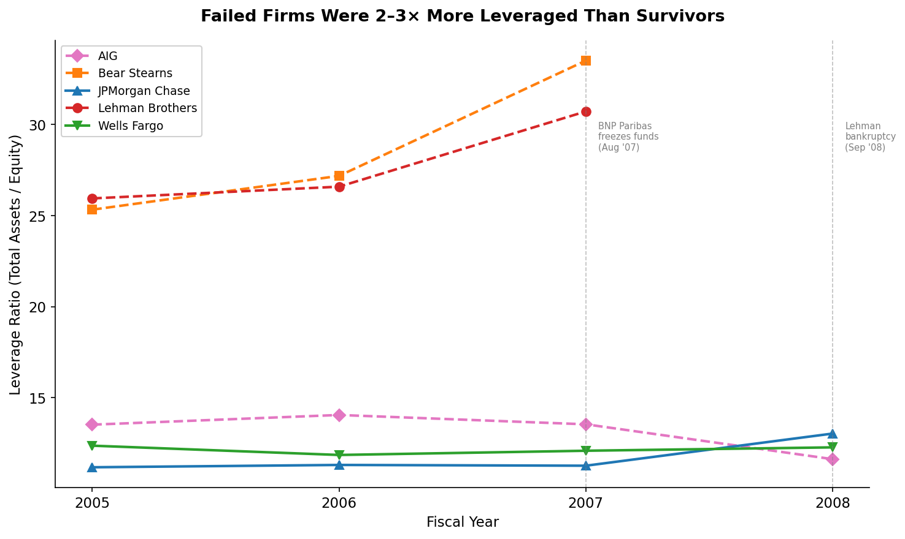
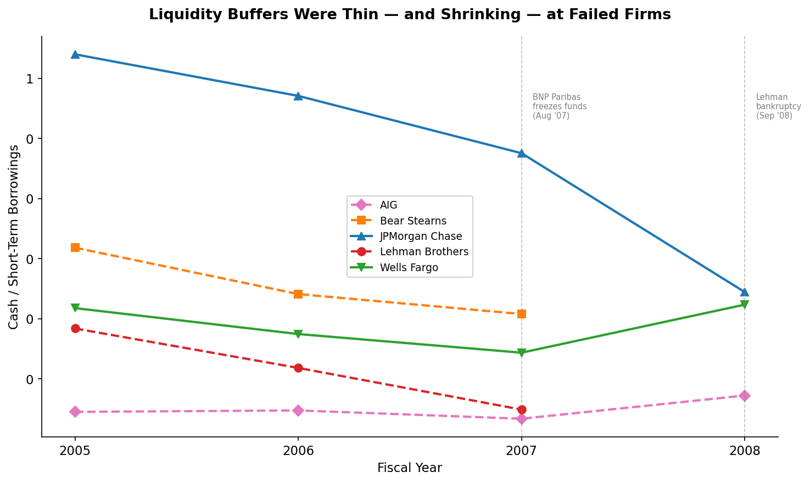
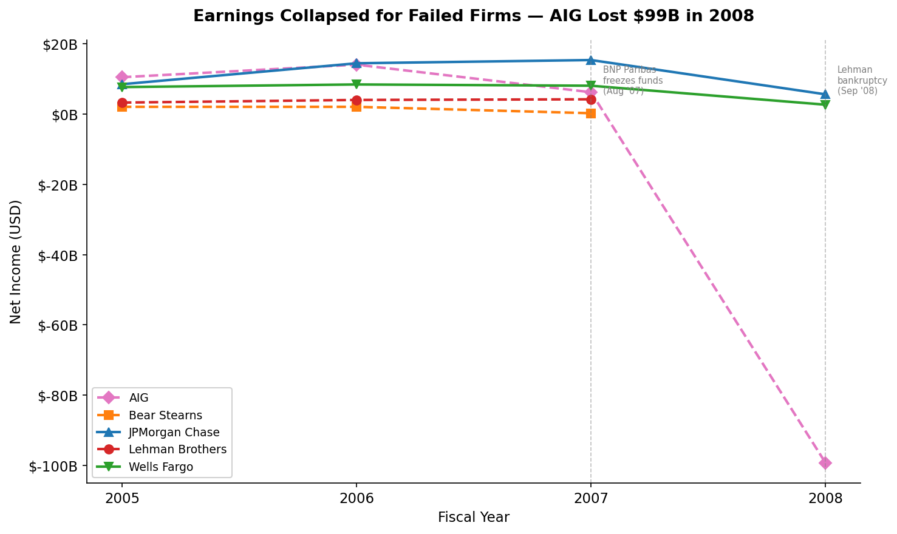
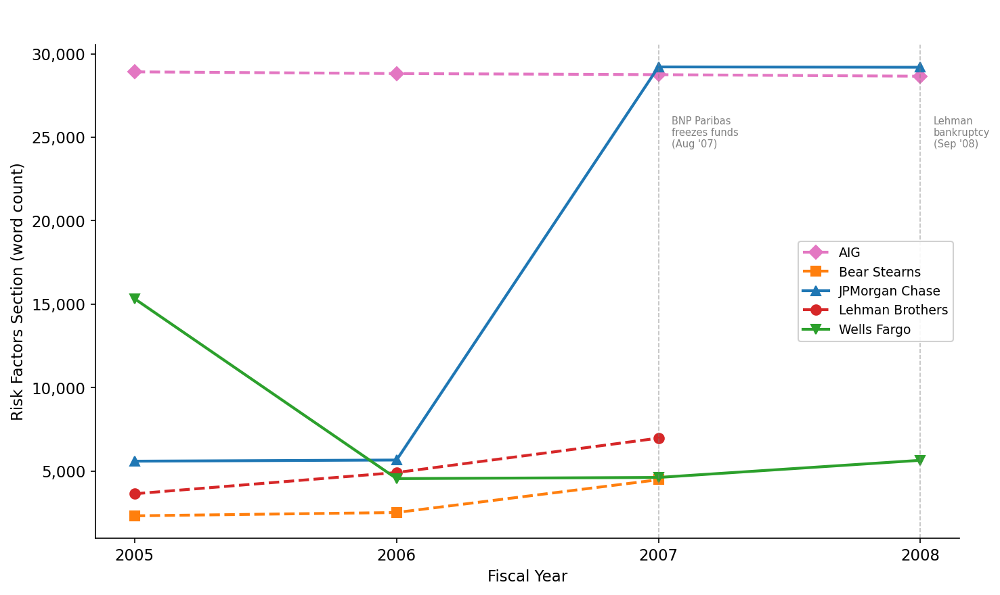
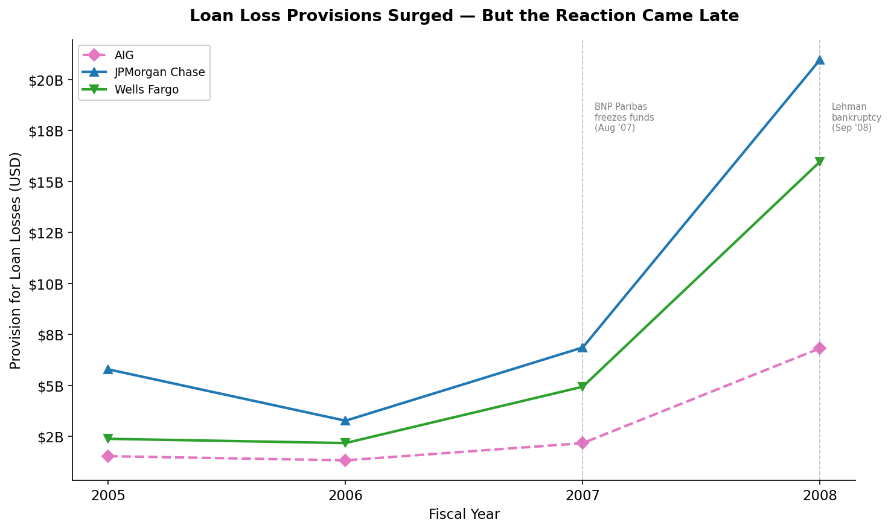
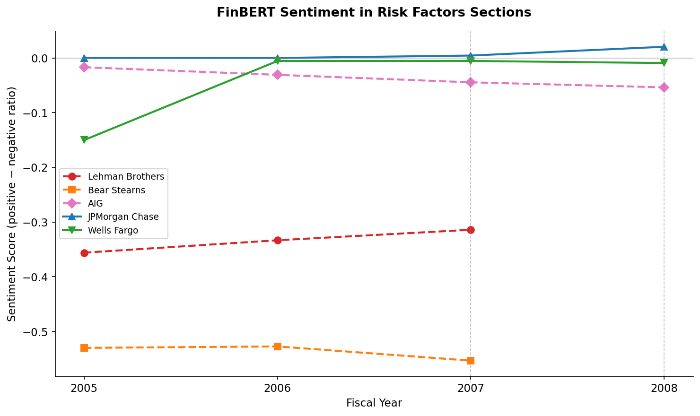
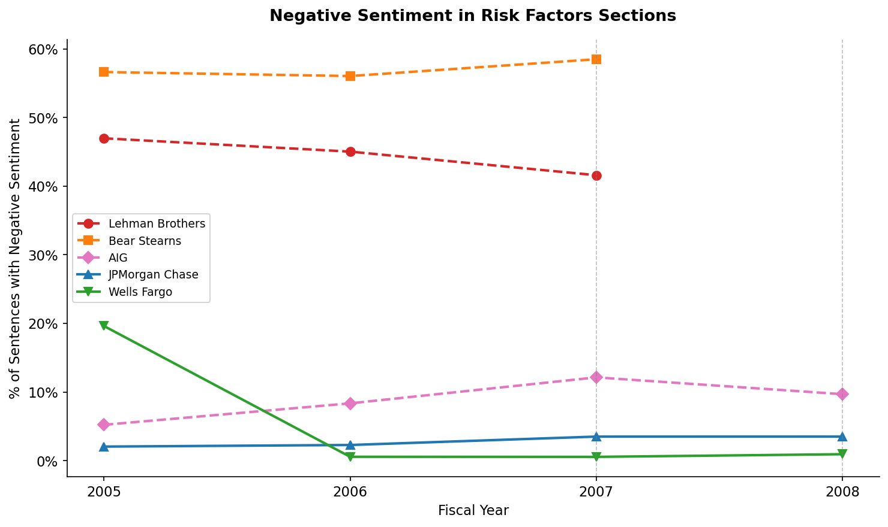
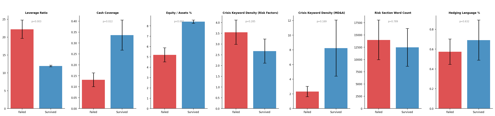
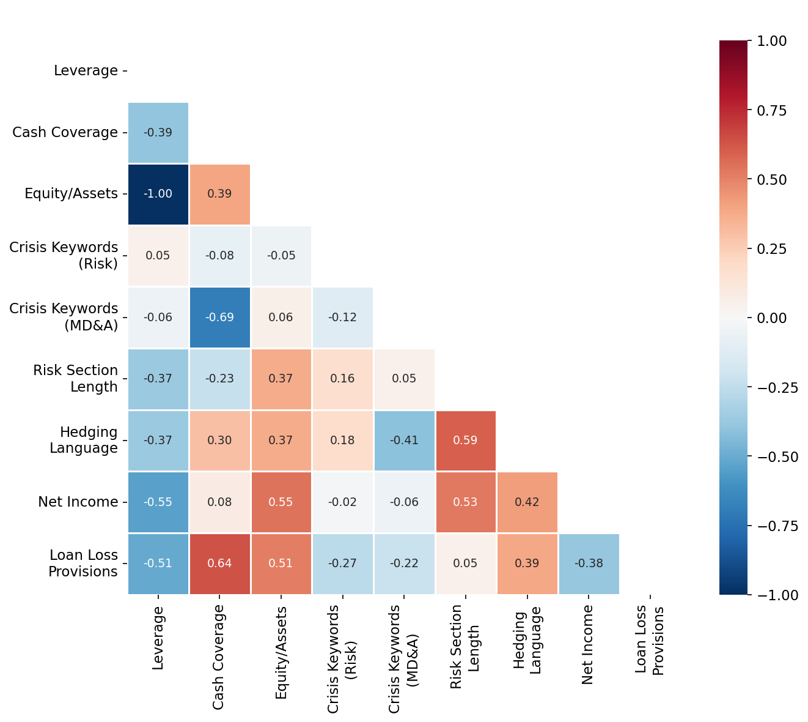

# Explaining 2008 Financial Crisis Through SEC Filings

## Summary
- Scraped and parsed 20 pre-crisis 10-K filings directly from SEC EDGAR using a custom HTML extraction pipeline
- Failed firms carried 2–3× more leverage than survivors, with Bear Stearns reaching 33.5:1
- FinBERT sentiment analysis revealed a 15× gap in negative risk language between failed and surviving firms
- Lehman Brothers decreased crisis-related disclosures while increasing leverage — consistent with the later-discovered Repo 105 deception

Public SEC filings contained detectable warning signs well before the financial collapse of September 2008, when Lehman 
Brothers filed the largest bankruptcy in U.S. history and the federal government bailed out AIG with $85 billion. Using 
balance sheet data and basic text analysis of 10-K filings, we can distinguish firms that failed from those that 
survived, with signals visible as early as 2006.

Question:
Were the warning signs of the 2008 financial crisis visible in public SEC filings, and could a data-driven analyst have 
identified which firms were most at risk?

## Contents

- [Data Collection & Extraction](#data-collection-and-extraction)
   - [Locating Files](#locating-files)
   - [Downloading 10-K HTML](#downloading-10-k-html)
   - [Extracting Financial Data](#extracting-financial-data)
   - [Extracting Filing Text for NLP](#extracting-filing-text-for-nlp)
- [Feature Engineering](#feature-engineering)
   - [Quantitative Features](#quantitative-features-from-balance-sheet--income-statement-data)
   - NLP Features
     - [Keyword Counting](#nlp-features---keyword-counting)
     - [FinBERT sentiment](#nlp-features---finbert-sentiment)
- [EDA Approach](#eda-approach)
- [Key Findings](#key-findings)
   - [1. Leverage Was A Clear Signal](#1-leverage-was-a-clear-signal)
   - [2. Liquidity Was Evaporating](#2-liquidity-was-evaporating)
   - [3. Filing Language Told Different Stories](#3-filing-language-told-different-stories)
   - [4. Survivors Invested in Risk Disclosure](#4-survivors-invested-in-risk-disclosure)
   - [5. Provisions Showed Who Was Prepping](#5-provisions-showed-who-was-preparing)
   - [6. FinBERT Sentiment Reveals Stark Divide](#6-finbert-sentiment-reveals-stark-divide)
- [The Asymmetry Argument](#the-asymmetry-argument)
- [Statistical Notes](#statistical-notes)
- [Limitations](#limitations)
- [Project Structure](#project-structure)
- [How to Reproduce](#how-to-reproduce)

## Data Collection and Extraction
All data was sourced directly from SEC EDGAR, the SEC's public database of corporate filings. No paid data providers 
were used.

### Locating Files
The SEC provides a submissions API (data.sec.gov/submissions/) that returns a company's full filing history as JSON, 
given its CIK (Central Index Key) number. For large filers like JPMorgan (64 pagination files, thousands of filings), 
the API splits history across multiple JSON files, the pipeline fetches and merges all of them to locate 10-K annual 
reports in the 2005–2008 window.

### Downloading 10-K HTML
Each 10-K filing has a primary HTML document hosted on SEC archives. The pipeline constructs the URL from the accession 
number and downloads it, trying www.sec.gov first and falling back to data.sec.gov if the primary server returns a 503 
error. All downloaded HTML is cached locally so re-runs skip already-fetched files.

### Extracting Financial Data

XBRL structured data, the machine-readable format that would make this trivial, was not mandatory until 2009. Lehman 
Brothers and Bear Stearns filed no XBRL whatsoever. This meant financial data had to be extracted from raw HTML.

An automated scraper converts each 10-K's HTML to plain text, then uses regex to find financial line items (e.g., 
"Total assets," "Net income") and extract the nearest numeric value. A unit detection step identifies whether the filing
reports in millions, thousands, or raw dollars by searching for phrases like "in millions" near financial statement 
headers.

This approach works for most filings but pre-2009 HTML formatting is wildly inconsistent, including nested tables, 
values inside 
`<DIV>` tags with CSS indentation, and varying label conventions across firms. 
A validation layer (`validate_financials.py`) runs automated sanity checks on the scraped data: verifying the accounting
identity (assets ≈ liabilities + equity), flagging cases where the scraper grabbed the wrong number 
(e.g., total liabilities matching total assets exactly), and detecting unit mismatches where values jump 100× between 
years. Where the scraper produced incorrect values, verified reference data sourced from the original 10-K filings is 
used instead, with every override logged.

Wells Fargo's 10-K primary documents turned out to be shell filings, the actual financial statements were in a separate
exhibit (Exhibit 13, the Annual Report to Stockholders). The scraper correctly identified no data in these files, and 
reference data was used for all Wells Fargo years.

### Extracting Filing Text for NLP

Risk Factors (Item 1A) and Management's Discussion & Analysis (Item 7) sections were extracted by converting the full 
10-K HTML to plain text (stripping tags, normalizing whitespace), then identifying section boundaries with regex 
patterns. The script tries multiple pattern variants, from specific (`item 7. management's discussion and analysis`) to 
broad (`management discussion`) and uses the last match in the document to skip table-of-contents entries that also 
contain the section header. This achieved 32/32 extraction success across all available filings (100% of files where 
HTML was present).

## Feature Engineering

### Quantitative features (from balance sheet / income statement data)
- *Leverage ratio* (total assets / equity) - measures how much borrowed money backs each dollar of equity. Lehman at 
- 30:1 means a 3% asset decline wipes out all equity.
- *Cash coverage ratio* (cash / short-term borrowings) - can the firm cover its near-term debts with cash on hand?
- *Equity-to-assets percentage* - inverse of leverage, sometimes more intuitive.
- *Net income trajectory* - year-over-year earnings trend.
- *Loan loss provisions* - capital set aside to absorb expected credit losses. Only applicable to commercial banks 
- (JPMorgan, Wells Fargo) and AIG; investment banks (Lehman, Bear Stearns) don't report this.

### NLP features - Keyword Counting
- *Crisis keyword density* - occurrences of terms in six categories (subprime, liquidity risk, default, counterparty, 
- write-down, off-balance-sheet) measured per 1,000 words in Risk Factors and MD&A sections. The keyword dictionary is curated to the crisis narrative, not generic sentiment.
- *Risk section word count growth* - tracks how much firms expanded their risk disclosures year-over-year. A ballooning risk section is a known early-warning signal.
- *Hedging language percentage* - uncertainty words ("may," "could," "uncertain," "no assurance") as a share of MD&A text.

### NLP features - FinBERT Sentiment
- FinBERT (a BERT model fine-tuned on 10,000+ financial news sentences by Prosus AI) applied at the sentence level to Risk Factors and MD&A sections.
- Each sentence is classified as positive, negative, or neutral with a confidence score.
- Quality filtering removes table fragments, boilerplate, and lines that are mostly numbers before scoring.
- Aggregate metrics: negative sentence ratio, positive sentence ratio, and composite sentiment score (positive minus negative ratio).

## EDA Approach

Each feature is visualized as a time series (FY2005–2008) with firms grouped by outcome, specifically failed 
(Lehman Brothers, Bear Stearns, AIG) vs. survived (JPMorgan Chase, Wells Fargo). Failed firms are plotted with dashed 
lines in warm colors (red, orange, pink); survivors use solid lines in cool colors (blue, green).

[//]: # (A combined dashboard provides a single-view summary across all six core features. Statistical validation uses Welch's t-tests, Mann-Whitney U tests, and Spearman correlations to assess whether observed differences are meaningful given the small sample size.)

## Key Findings

### 1. Leverage Was A Clear Signal

Failed investment banks operated at 25-33× leverage while survivors stayed at 11-13×. Bear Stearns hit 33.5:1 in FY2007 
- for every dollar of equity, they held $33.50 in assets. A 3% decline in asset values would wipe out all equity. 
- JPMorgan never exceeded 13:1.



| Firm | FY2005 | FY2006 | FY2007 | Status |
|---|---|---|---|---|
| Bear Stearns | 25.3× | 27.2× | **33.5×** | Failed |
| Lehman Brothers | 25.9× | 26.6× | **30.7×** | Failed |
| JPMorgan Chase | 11.2× | 11.3× | 11.3× | Survived |
| Wells Fargo | 12.4× | 11.9× | 12.1× | Survived |

### 2. Liquidity Was Evaporating

Lehman's cash-to-short-term-borrowings ratio fell from 0.18 to 0.05 between FY2005 and FY2007. They could cover less 
than 5% of their short-term debt with cash on hand. JPMorgan maintained 10× more coverage throughout the same period.



### 3. Filing Language Told Different Stories

Bear Stearns and AIG showed sharp increases in crisis-related terminology in their FY2007 Risk Factors sections, crisis
keyword density nearly doubled for both. They were acknowledging the risk, even if they couldn't manage it.

Lehman was the opposite: crisis keyword density *decreased* from FY2005 to FY2007 while leverage *increased*. They were 
taking on more risk while talking about it less. This aligns with the post-collapse discovery of Repo 105 transactions, 
where Lehman used accounting maneuvers to temporarily hide leverage at quarter-end.



### 4. Survivors Invested in Risk Disclosure

JPMorgan's Risk Factors section expanded 5× between FY2006 and FY2007 (5,657 → 29,214 words), suggesting the firm was 
proactively documenting emerging risks. Their loan loss provisions also tripled from \$3.3B to \$6.9B in the same period,
they were reserving capital for expected losses while others weren't.



### 5. Provisions Showed Who Was Preparing

JPMorgan increased loan loss provisions from \$3.3B (FY2006) to \$21.0B (FY2008), a 6× increase. Wells Fargo went from 
\$2.2B to \$16.0B. Both were aggressively setting aside capital. AIG's provisions also grew but from a much smaller base, 
and Lehman/Bear Stearns didn't report this metric at all (as investment banks, not commercial lenders).



### 6. FinBERT Sentiment Reveals Stark Divide

FinBERT sentence-level sentiment analysis on Risk Factors sections shows a dramatic gap between failed and surviving 
firms. Bear Stearns and Lehman had 40–58% of their Risk Factors sentences classified as negative, over half their risk 
disclosures carried negative tone. JPMorgan stayed below 4% across all years.

| Firm | FY2005 | FY2006 | FY2007 | Status |
|---|---|---|---|---|
| Bear Stearns | 56.6% neg | 56.0% neg | **58.5% neg** | Failed |
| Lehman Brothers | 47.0% neg | 45.0% neg | 41.6% neg | Failed |
| AIG | 5.2% neg | 8.3% neg | **12.1% neg** | Failed |
| JPMorgan Chase | 2.0% neg | 2.3% neg | 3.5% neg | Survived |

AIG's trajectory is particularly telling: negative sentiment in Risk Factors more than doubled from FY2005 to FY2007, 
reflecting growing awareness of credit deterioration even before the $99B loss in FY2008.

In MD&A sections (where available), Lehman's positive sentiment collapsed from +0.20 to +0.06 while negative sentences
jumped from 9.3% to 14.5% between FY2005 and FY2007, the filing tone was becoming measurably more pessimistic even as 
management publicly projected confidence.

*Note: Sentence-level quality filtering removed table fragments, boilerplate, and lines with insufficient text before scoring. MD&A analysis was limited to firms with prose-heavy sections (Lehman, AIG, Wells Fargo FY2005).*



## The Asymmetry Argument

The information was public, but the incentives were misaligned. Every data point in this analysis came from filings that
were available to any investor, regulator, or analyst at the time of publication. The 30:1 leverage ratios were in the 
balance sheets. The thinning liquidity was in the footnotes. The crisis language was in the MD&A sections.

Yet the market didn't price it in until it was too late. This suggests the problem wasn't information availability, it 
was attention allocation. Critical risk data was buried in 100+ page filings alongside boilerplate language, and the 
firms most at risk had the least incentive to make it legible.

## Statistical Notes

Welch's t-tests and Mann-Whitney U tests were used to compare failed vs. survived groups. With only 5 firms and 3 to 4 
years of data, statistical power is limited, the sample size is a real constraint. However, the leverage ratio shows 
large effect sizes (Cohen's d) and consistent separation across all years. The NLP features show directional differences
but should be interpreted as exploratory given the small sample. Spearman correlations between financial and text 
features suggest that crisis keyword density is positively associated with leverage, though the relationship is not 
strong enough to claim predictive power with this sample.




## Limitations

- Hindsight Bias
  - Firms and features were selected with full knowledge of the crisis outcome. The failed firms were chosen because they failed; the features were chosen because they relate to known causes of the collapse. A real-time analyst in 2006 would not have had this framing. This analysis demonstrates that warning signs were present in public filings, not that they would have been identified without the benefit of hindsight.
- Small sample (5 firms) 
  - limits statistical power and generalizability. Results should be treated as case-study evidence, not population-level inference.
- Survivorship framing is imperfect
  - JPMorgan and Wells Fargo both received TARP funds. "Survived" means they weren't acquired or bankrupted, not that they were unaffected.
- XBRL unavailable pre-2009 
  - financial data required an automated HTML scraper with a validation layer. Some values were verified against reference data where scraper accuracy was uncertain.
- Missing filings 
  - At the time of writing this project the Lehman FY2005 and JPMorgan FY2006 HTML files were unavailable due to SEC server maintenance during data collection. Lehman has no FY2008 (bankrupt Sep 2008) and Bear Stearns has no FY2008 (acquired Mar 2008).
- NLP is crude for keyword counting 
  - keyword counting ignores context and negation. FinBERT sentiment addresses this partially but was only viable for firms with prose-heavy sections. Bear Stearns, JPMorgan, and Wells Fargo had table-heavy MD&A sections that produced too few scoreable paragraphs for MD&A sentiment analysis.
- Wells Fargo text extraction anomaly 
  - the FY2005 Risk Factors word count (15,317) appears inflated relative to other years (~4,500–5,600), likely due to section boundary detection capturing adjacent content.
- Correlation ≠ causation 
  - these features correlate with failure but this analysis cannot prove they would have been predictive in real-time.

## Project Structure

```
src/
├── config.py                 # CIKs, date ranges, keyword dictionaries
├── pull_financials.py        # Scrape financials from 10-K HTML via EDGAR API
├── validate_financials.py    # Sanity checks + reference data validation
├── pull_filings_text.py      # Extract Risk Factors & MD&A sections
├── features.py               # Quantitative + NLP feature engineering
├── 01_eda.py                 # EDA charts
├── 02_statistics.py          # Statistical tests
└── 03_sentiment.py           # FinBERT sentiment analysis

data/
├── raw/html/                 # Cached 10-K HTML files from EDGAR
├── raw/submissions/          # Cached EDGAR submission histories
├── texts/                    # Extracted filing text sections
└── processed/                # Feature CSVs

figures/                      # All generated charts
```

## Requirements

```
pip install -r requirements.txt
```

## How to Reproduce

```bash
cd src/
python pull_financials.py        # Download + parse 10-K filings from EDGAR
python validate_financials.py    # Validate scraped data
python pull_filings_text.py      # Extract text sections for NLP
python features.py               # Engineer all features
python eda.py                    # Generate charts
python statistics.py             # Run statistical tests
python sentiment.py              # FinBERT sentiment analysis
```